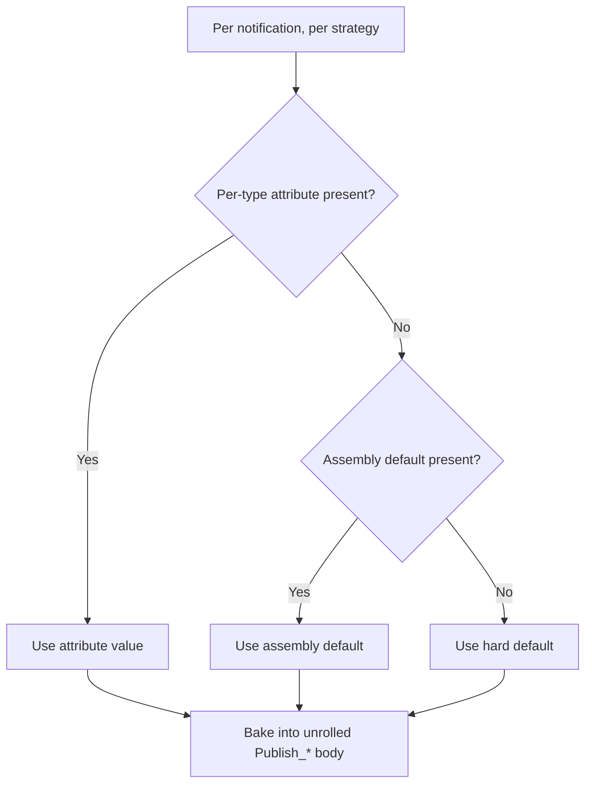

## 1. Public API shape (in `MediatorLite.Abstractions`)

Edit [src/MediatorLite.Abstractions/Abstractions/Attributes.cs](src/MediatorLite.Abstractions/Abstractions/Attributes.cs):

- **Delete** `NotificationOptionsAttribute` (hard break).
- **Add** four new attributes. Presence = "set", absence = "unset" — this removes the "distinguish unset" problem without sentinel values or flag booleans:

```csharp
[AttributeUsage(AttributeTargets.Class, AllowMultiple = false, Inherited = false)]
public sealed class NotificationExecutionAttribute(NotificationExecutionStrategy strategy) : Attribute
{
    public NotificationExecutionStrategy Strategy { get; } = strategy;
}

[AttributeUsage(AttributeTargets.Class, AllowMultiple = false, Inherited = false)]
public sealed class NotificationErrorAttribute(NotificationErrorStrategy strategy) : Attribute
{
    public NotificationErrorStrategy Strategy { get; } = strategy;
}

[AttributeUsage(AttributeTargets.Assembly, AllowMultiple = false, Inherited = false)]
public sealed class DefaultNotificationExecutionAttribute(NotificationExecutionStrategy strategy) : Attribute
{
    public NotificationExecutionStrategy Strategy { get; } = strategy;
}

[AttributeUsage(AttributeTargets.Assembly, AllowMultiple = false, Inherited = false)]
public sealed class DefaultNotificationErrorAttribute(NotificationErrorStrategy strategy) : Attribute
{
    public NotificationErrorStrategy Strategy { get; } = strategy;
}
```

Rationale for split: your rule 4 is per-strategy ("for any strategy not provided per notification, fall back to defaults"). Two attributes makes "provided" literally mean "the attribute exists on the type", which maps 1:1 to the resolution rule and eliminates `OverrideGlobal` as a redundant knob.

## 2. `MediatorOptions` clean-up

Edit [src/MediatorLite/Configuration/MediatorOptions.cs](src/MediatorLite/Configuration/MediatorOptions.cs):

- Delete `NotificationExecutionStrategy` and `NotificationErrorStrategy` properties (lines 11-23). All other properties remain — they are legitimately runtime concerns.

## 3. Interface clean-up

Edit [src/MediatorLite.Abstractions/Abstractions/ISourceGeneratedMediator.cs](src/MediatorLite.Abstractions/Abstractions/ISourceGeneratedMediator.cs):

- Remove the `GetNotificationOptions(Type)` method. It has no remaining consumer once strategies are inlined into `Publish_*`.

Edit [src/MediatorLite/Internal/NullSourceGeneratedMediator.cs](src/MediatorLite/Internal/NullSourceGeneratedMediator.cs):

- Remove the corresponding `GetNotificationOptions` method.

## 4. Source generator rework

Edit [src/MediatorLite.SourceGeneration/HandlerDiscoveryGenerator.cs](src/MediatorLite.SourceGeneration/HandlerDiscoveryGenerator.cs):

### 4a. Discover assembly defaults

Add a new `IncrementalValueProvider<AssemblyDefaults>` fed from `context.CompilationProvider`, reading `compilation.Assembly.GetAttributes()` for `DefaultNotificationExecutionAttribute` / `DefaultNotificationErrorAttribute`. Shape:

```csharp
internal readonly record struct AssemblyDefaults(int? ExecutionStrategy, int? ErrorStrategy);
```

Combine it into the generator's tuple alongside handlers/notifications/behaviors/validators (the existing `Combine` chain around lines 52-56).

### 4b. Replace `NotificationTypeInfo` discovery

Rewrite `GetNotificationInfo` (lines 79-121) to look for the two new per-notification attributes rather than the retired `NotificationOptionsAttribute`. `NotificationTypeInfo` becomes:

```csharp
internal sealed record NotificationTypeInfo(
    string TypeName,
    int? ExecutionStrategy,   // null when [NotificationExecution] absent
    int? ErrorStrategy);      // null when [NotificationError] absent
```

Notifications with neither attribute must still be discovered (so the generator sees them and can merge with globals), but the current code returns `null` when no attribute is present — change that so every `INotification` type yields a record, with both strategy slots null when unannotated.

### 4c. Resolution helper

Add a static helper on the generator (pure, testable, no Roslyn types):

```csharp
private static (int Execution, int Error) ResolveStrategies(
    NotificationTypeInfo perType,
    AssemblyDefaults globals)
{
    int execution = perType.ExecutionStrategy        // per-notification wins
                 ?? globals.ExecutionStrategy        // else global
                 ?? 0;                                // else Sequential default
    int error     = perType.ErrorStrategy
                 ?? globals.ErrorStrategy
                 ?? 0;                                // else StopOnFirstError default
    return (execution, error);
}
```

This gives the exact precedence the user wants, per-strategy: per-notification > global > hard default. There is no `OverrideGlobal` — per-notification presence already means "override".

### 4d. Emit single unrolled body

In `GenerateUnrolledNotificationPublisher` (line 967), stop reading per-attribute values directly. Instead call `ResolveStrategies(...)` once per notification, then dispatch to the existing `GenerateSequentialNotificationExecution` / `GenerateParallelNotificationExecution` / `GenerateStopOnFirstNotificationExecution` with the resolved ints. No new emitted branches — the three emitter methods already produce branch-free code.

### 4e. Remove dead emission

- Delete the `_notificationOptionsMap` static dictionary (lines 819-829).
- Delete the generated `GetNotificationOptions` override (lines 844-856).
- Update `NullSourceGeneratedMediator` and the empty-registration path in `GenerateEmptyRegistration` if they reference the removed members.

## 5. Test updates

- [tests/MediatorLite.Tests/UnitTests/AttributeTests.cs](tests/MediatorLite.Tests/UnitTests/AttributeTests.cs): rewrite `NotificationOptionsAttribute_SetsProperties` into four small tests for the four new attributes.
- [tests/MediatorLite.Tests/SourceGeneration/TestTypes.cs](tests/MediatorLite.Tests/SourceGeneration/TestTypes.cs): replace the five `[NotificationOptions(...)]` usages with their `[NotificationExecution]` + `[NotificationError]` equivalents.
- [tests/MediatorLite.Tests/SourceGeneration/NotificationTests.cs](tests/MediatorLite.Tests/SourceGeneration/NotificationTests.cs): drop the `options.NotificationExecutionStrategy = ...` setup at lines 52, 217, 218 and the `GetNotificationOptions` assertions at lines 152-157. Add new tests for:
  - assembly default + no per-type attr → uses global.
  - assembly default + per-type attr → per-type wins (per-strategy).
  - neither → defaults.
  - per-type attr only one of the two present → other falls back to global or default.
- [tests/MediatorLite.Benchmarks/MediatorBenchmarks.cs](tests/MediatorLite.Benchmarks/MediatorBenchmarks.cs) lines 366 & 380, and [tests/MediatorLite.RestApiBenchmarks/Hosting/ApiBenchmarkHost.cs](tests/MediatorLite.RestApiBenchmarks/Hosting/ApiBenchmarkHost.cs) line 86: remove the `options.NotificationExecutionStrategy = ...` lines. If a benchmark needs to exercise Parallel, add `[assembly: DefaultNotificationExecution(NotificationExecutionStrategy.Parallel)]` in the benchmark project's `AssemblyInfo`-style file.

## 6. Samples & docs

- [samples/MediatorLite.Sample.SourceGen/Program.cs](samples/MediatorLite.Sample.SourceGen/Program.cs): nothing references the removed props, just confirm.
- Docs sweep (targeted replace, no new files): [docs/notifications.md](docs/notifications.md), [docs/quick-start.md](docs/quick-start.md), [docs/index.md](docs/index.md), [docs/migration-v1-to-v2.md](docs/migration-v1-to-v2.md), [docs/migration-from-mediatr.md](docs/migration-from-mediatr.md), [src/MediatorLite.SourceGeneration/README.md](src/MediatorLite.SourceGeneration/README.md), and [README.md](README.md) — replace `[NotificationOptions(...)]` examples with the two split attributes; replace the "these runtime options are ignored" passages with "these runtime options no longer exist; use `[assembly: DefaultNotificationExecution]` / `[assembly: DefaultNotificationError]`".
- [AGENTS.md](AGENTS.md): update the line currently saying "`MediatorOptions.NotificationExecutionStrategy` and `NotificationErrorStrategy` are ignored by generated notification dispatch" to reflect the new design.

## 7. Validation

- `dotnet test MediatorLite.sln` must pass.
- Eyeball a generated `SourceGeneratedMediator.g.cs` for a notification with both an assembly default and a per-type override to confirm the emitted body has exactly one code path (no `if`/`switch` on strategies).
- Run `samples/MediatorLite.Sample.SourceGen` to confirm end-to-end.

## Resolution flow (compile-time, per strategy)



## Non-goals

- No attempt to support dynamic per-request overrides (would require runtime branching).
- No obsolete shim for `NotificationOptionsAttribute` or the removed `MediatorOptions` properties — hard break was explicitly approved.
- No change to `BehaviorOrderAttribute`, `NotificationHandlerOrderAttribute`, validator discovery, or request dispatch.