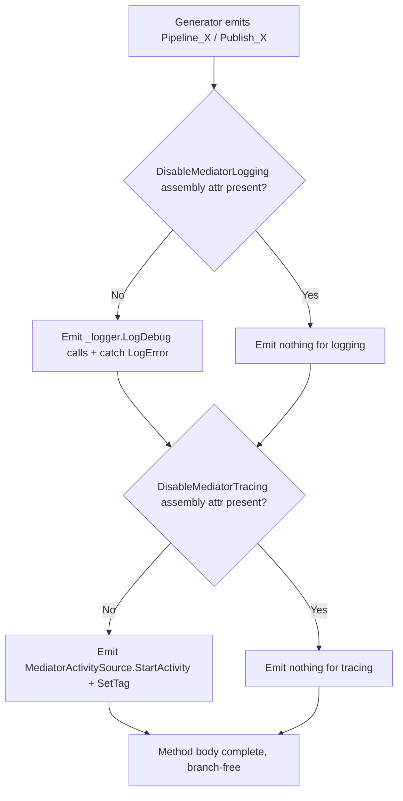

## Goals

- Drop `MediatorOptions.EnableBuiltInLogging`, `DefaultLogLevel`, `EnableTracing`, `HandlerLifetime`, `MediatorLifetime` — the entire `MediatorOptions` class disappears.
- `Mediator.cs` becomes branch-free: just `GetDispatcher(...)?.Invoke(...)` / `GetPublisher(...)?.Invoke(...)`. No `_options`, no `_logger`, no `EnableTracing` ternary.
- Source generator emits logging (`LogDebug` hardcoded) and tracing directly into each `Pipeline_*` and `Publish_*` method. Presence of `[assembly: DisableMediatorLogging]` / `[assembly: DisableMediatorTracing]` elides the emission entirely — not "branch with false", literally not emitted.
- Users control log level via `Microsoft.Extensions.Logging` filter configuration (idiomatic .NET). Users toggle tracing at runtime via `ActivityListener` / OpenTelemetry SDK.
- Delete the ghost `MediatorLoggingAttribute` and its doc/test references.
- Mediator lifetime hardcoded to `Transient` per user decision.

## Resolution flow (compile-time, per emission site)



## 1. Attribute surface

### 1a. Add the two opt-out attributes

In [src/MediatorLite.Abstractions/Abstractions/Attributes.cs](src/MediatorLite.Abstractions/Abstractions/Attributes.cs), add:

```csharp
[AttributeUsage(AttributeTargets.Assembly, AllowMultiple = false, Inherited = false)]
public sealed class DisableMediatorLoggingAttribute : Attribute { }

[AttributeUsage(AttributeTargets.Assembly, AllowMultiple = false, Inherited = false)]
public sealed class DisableMediatorTracingAttribute : Attribute { }
```

Default behavior (no attribute) = logging + tracing on, matching today's `MediatorOptions` defaults. No constructor arguments — presence alone encodes "off", symmetric with the `DefaultNotificationExecution/Error` pattern.

### 1b. Delete the ghost `MediatorLoggingAttribute`

Remove the `MediatorLoggingAttribute` class (lines 209-236 of [src/MediatorLite.Abstractions/Abstractions/Attributes.cs](src/MediatorLite.Abstractions/Abstractions/Attributes.cs)). It's never consumed by the generator or `Mediator.cs` — it's documentation-only surface that misleads users.

## 2. Delete `MediatorOptions` entirely

Delete [src/MediatorLite/Configuration/MediatorOptions.cs](src/MediatorLite/Configuration/MediatorOptions.cs). All five properties become dead with this migration.

## 3. Simplify `ServiceCollectionExtensions`

In [src/MediatorLite/Configuration/ServiceCollectionExtensions.cs](src/MediatorLite/Configuration/ServiceCollectionExtensions.cs):

- Change `AddMediatorLite(this IServiceCollection, Action<MediatorOptions>? configure = null)` to `AddMediatorLite(this IServiceCollection services)`.
- Drop `services.AddSingleton(options)`.
- Replace `new ServiceDescriptor(typeof(IMediator), typeof(Mediator), options.MediatorLifetime)` with `services.AddTransient<IMediator, Mediator>()`.
- Update the XML doc / example block (lines 20-36) to remove the `configure =>` snippet and mention the new assembly attributes instead.

## 4. Strip `Mediator.cs` to pure dispatch

Rewrite [src/MediatorLite/Internal/Mediator.cs](src/MediatorLite/Internal/Mediator.cs) to:

```csharp
internal sealed class Mediator : IMediator
{
    private readonly IServiceProvider _serviceProvider;
    private readonly ISourceGeneratedMediator _sourceGeneratedMediator;

    public Mediator(IServiceProvider serviceProvider, ISourceGeneratedMediator sourceGeneratedMediator)
    {
        _serviceProvider = serviceProvider ?? throw new ArgumentNullException(nameof(serviceProvider));
        _sourceGeneratedMediator = sourceGeneratedMediator ?? throw new ArgumentNullException(nameof(sourceGeneratedMediator));
    }

    [MethodImpl(MethodImplOptions.AggressiveInlining)]
    public async Task<TResponse> SendAsync<TResponse>(IRequest<TResponse> request, CancellationToken cancellationToken = default)
    {
        ArgumentNullException.ThrowIfNull(request);
        var requestType = request.GetType();
        var dispatcher = _sourceGeneratedMediator.GetDispatcher(requestType)
            ?? throw new InvalidOperationException(
                $"No handler registered for request type {requestType.FullName}. " +
                $"Ensure a handler implementing IRequestHandler<{requestType.Name}, {typeof(TResponse).Name}> " +
                "is registered and AddGeneratedHandlers() is called.");
        var result = await dispatcher(_serviceProvider, request, cancellationToken).ConfigureAwait(false);
        return (TResponse)result;
    }

    [MethodImpl(MethodImplOptions.AggressiveInlining)]
    public Task PublishAsync<TNotification>(TNotification notification, CancellationToken cancellationToken = default)
        where TNotification : INotification
    {
        ArgumentNullException.ThrowIfNull(notification);
        var publisher = _sourceGeneratedMediator.GetPublisher(typeof(TNotification));
        return publisher is null ? Task.CompletedTask : publisher(_serviceProvider, notification, cancellationToken);
    }
}
```

Key deletions vs current:

- No `ILogger<Mediator>` dependency (all logging moves into generated code).
- No `MediatorOptions` dependency.
- No `_options.EnableTracing`/`_options.EnableBuiltInLogging` branches.
- No activity creation here (moves into generated code).

Behavior change to note: the "no handlers registered for notification" debug log currently emitted in `PublishAsync` (lines 114-118) disappears. Silence is fine semantically — publishing a notification with no handlers is a no-op and users aren't expecting a log line.

## 5. Source generator updates ([src/MediatorLite.SourceGeneration/HandlerDiscoveryGenerator.cs](src/MediatorLite.SourceGeneration/HandlerDiscoveryGenerator.cs))

### 5a. Discover assembly opt-outs

Extend `AssemblyDefaults` (line 1224) to carry two more flags:

```csharp
internal readonly record struct AssemblyDefaults(
    int? ExecutionStrategy,
    int? ErrorStrategy,
    bool LoggingDisabled,
    bool TracingDisabled);
```

Extend `GetAssemblyDefaults` (lines 75-98) to also scan for `DisableMediatorLoggingAttribute` / `DisableMediatorTracingAttribute` by name, matching the existing pattern.

### 5b. Thread flags through `Execute` / `GenerateSourceGeneratedMediator`

`GenerateSourceGeneratedMediator` (line 795) already receives `AssemblyDefaults`. Pass the two new bools down into `GenerateUnrolledPipeline` (line 934) and `GenerateUnrolledNotificationPublisher` (line 997).

### 5c. Emit logging/tracing in `Pipeline_*`

Update `GenerateUnrolledPipeline` (lines 934-990). Pseudo-template for what to emit inside the method body, controlled by the two flags:

```csharp
[MethodImpl(MethodImplOptions.AggressiveInlining)]
private static async Task<object> Pipeline_Foo(IServiceProvider sp, Foo request, CancellationToken ct)
{
    // [EMIT IF !LoggingDisabled]
    var __logger = sp.GetRequiredService<global::Microsoft.Extensions.Logging.ILogger<global::MediatorLite.Internal.Mediator>>();
    __logger.LogDebug("Sending request {RequestType}", "Foo");
    // [END LOGGING PROLOGUE]

    // [EMIT IF !TracingDisabled]
    using var __activity = global::MediatorLite.Diagnostics.MediatorActivitySource.Source.StartActivity(
        "mediator.send_request Foo", global::System.Diagnostics.ActivityKind.Internal);
    __activity?.SetTag(global::MediatorLite.Diagnostics.MediatorActivitySource.Tags.RequestType, "Foo");
    __activity?.SetTag(global::MediatorLite.Diagnostics.MediatorActivitySource.Tags.ResponseType, "TResponse");
    // [END TRACING PROLOGUE]

    try
    {
        // existing behavior-chain + handler call (unchanged)
        var result = await /* existing pipeline */.ConfigureAwait(false);

        // [EMIT IF !LoggingDisabled]
        __logger.LogDebug("Request {RequestType} handled successfully", "Foo");
        // [END]

        return result!;
    }
    catch (global::System.Exception __ex)
    {
        // [EMIT IF !TracingDisabled]
        __activity?.SetTag(global::MediatorLite.Diagnostics.MediatorActivitySource.Tags.Error, true);
        __activity?.SetTag(global::MediatorLite.Diagnostics.MediatorActivitySource.Tags.ErrorMessage, __ex.Message);
        // [END]

        // [EMIT IF !LoggingDisabled]
        __logger.LogError(__ex, "Error handling request {RequestType}", "Foo");
        // [END]

        throw;
    }
}
```

Key points:

- `__logger` and `__activity` are locals per method, resolved lazily. `ILogger<T>` is a MEL singleton so resolution is cheap.
- String literal for `{RequestType}` / `{ResponseType}` — no runtime `.Name` call (we know the name at codegen time). Minor perf improvement vs today's `requestType.Name`.
- When both flags are set the whole try/catch may become pointless (no tags, no logs). In that case just emit the plain pipeline body without the try/catch to keep generated code tight.
- Hardcode `LogDebug` (no `DefaultLogLevel`). MEL filter config owns level selection.

### 5d. Emit logging/tracing in `Publish_*`

Same treatment for `GenerateUnrolledNotificationPublisher` (line 997). Inject the logging/tracing prologue/epilogue/catch once at the top/bottom of the method, wrapping whichever of the three strategy bodies (`Sequential` / `Parallel` / `StopOnFirst`) the generator picks. Do not push logging into the per-handler loop bodies — it belongs at the notification publish boundary, matching today's `Mediator.PublishAsync` scope.

Log messages preserved today in `PublishAsync`:
- "Publishing notification {NotificationType}" (prologue)
- "Notification {NotificationType} published successfully" (epilogue)
- "Error publishing notification {NotificationType}" (catch)

### 5e. Fully-disabled fast path

When both `LoggingDisabled` and `TracingDisabled` are true, skip the try/catch wrapper and the locals entirely — emit only the pipeline/handler body. This keeps the generated code readable and free of dead `try { ... } catch { throw; }` frames when users have opted out of both.

### 5f. Null-registration path

Update `GenerateEmptyRegistration` (line 521) — no action required; it emits no `Pipeline_*`/`Publish_*` bodies.

## 6. Test updates

### 6a. `AttributeTests` ([tests/MediatorLite.Tests/UnitTests/AttributeTests.cs](tests/MediatorLite.Tests/UnitTests/AttributeTests.cs))

- Delete `MediatorLoggingAttribute_SetsProperties` (lines 50-62) — class is removed.
- Add two trivial tests asserting `DisableMediatorLoggingAttribute` and `DisableMediatorTracingAttribute` can be instantiated and have correct `AttributeUsage`.

### 6b. `MediatorTests` ([tests/MediatorLite.Tests/SourceGeneration/MediatorTests.cs](tests/MediatorLite.Tests/SourceGeneration/MediatorTests.cs))

- Lines 199-237: `SendAsync_WithTracingEnabled_DoesNotThrow` and `SendAsync_WithLoggingEnabled_DoesNotThrow` — drop the `options => { options.EnableTracing = true; }` setup; they now just exercise `AddMediatorLite()` with defaults (which is the enabled path). Tests themselves remain valuable as smoke tests that the default-on emitted logging/tracing compiles and runs without throwing.

### 6c. `NotificationTests` ([tests/MediatorLite.Tests/SourceGeneration/NotificationTests.cs](tests/MediatorLite.Tests/SourceGeneration/NotificationTests.cs))

- Lines 236-282: same treatment — drop the `options.EnableTracing` / `options.EnableBuiltInLogging` setup; tests now just verify `AddMediatorLite()` default-on path.

### 6d. Disabled-path coverage (optional, proposed scope)

Assembly-level attributes can't be toggled per test inside a single test assembly. Two options:

- **Proposed:** rely on `tests/MediatorLite.Benchmarks` and `tests/MediatorLite.RestApiBenchmarks` to exercise the disabled path (they do disable today; see step 7). Visual inspection of generated code via `EmitCompilerGeneratedFiles` during `dotnet test` is sufficient for this pass.
- **Alternative (out of scope by default):** add a new `tests/MediatorLite.Tests.DisabledObservability` assembly with `[assembly: DisableMediatorLogging]` / `[assembly: DisableMediatorTracing]` and a handful of smoke tests. I'd skip this unless you want the regression tripwire now.

## 7. Benchmarks / sample updates

### 7a. `tests/MediatorLite.Benchmarks`

- [tests/MediatorLite.Benchmarks/MediatorBenchmarks.cs](tests/MediatorLite.Benchmarks/MediatorBenchmarks.cs) lines 218-219, 274-275, 331-332, 392-393: delete the `options.EnableBuiltInLogging = false; options.EnableTracing = false;` lines. Replace with a single assembly-level declaration in an `AssemblyInfo.cs` (or the main benchmark file's top-level using block):

```csharp
[assembly: DisableMediatorLogging]
[assembly: DisableMediatorTracing]
```

This preserves the benchmarks' intent (measure pure dispatch cost) without per-benchmark setup.

### 7b. `tests/MediatorLite.RestApiBenchmarks`

- [tests/MediatorLite.RestApiBenchmarks/Hosting/ApiBenchmarkHost.cs](tests/MediatorLite.RestApiBenchmarks/Hosting/ApiBenchmarkHost.cs) lines 84-85: same — drop the two lines and add `[assembly: DisableMediatorLogging]` / `[assembly: DisableMediatorTracing]` at the top of the file or in an AssemblyInfo.

### 7c. Sample

- [samples/MediatorLite.Sample.SourceGen/Program.cs](samples/MediatorLite.Sample.SourceGen/Program.cs) lines 55-60 (the `AddMediatorLite(options => { ... })` block): replace with plain `AddMediatorLite()`. Defaults (logging + tracing on) are appropriate for a sample.

## 8. Docs sweep

Targeted replace — no new files. For each, remove `options => { ... }` lambdas that touch the deleted properties, remove `MediatorLoggingAttribute` examples, and reference the new assembly attributes where opt-out is discussed:

- [README.md](README.md) lines 150-151.
- [docs/index.md](docs/index.md) — scan for `EnableBuiltInLogging` / `EnableTracing` examples.
- [docs/quick-start.md](docs/quick-start.md) lines 88-89.
- [docs/notifications.md](docs/notifications.md) — scan.
- [docs/observability.md](docs/observability.md) lines 7, 16-17, 24-30, 40 — this is the heaviest doc. Rewrite the "runtime-configurable via `MediatorOptions`" framing; document `[assembly: DisableMediatorLogging]` / `[assembly: DisableMediatorTracing]` as the opt-out mechanism, MEL filter config as the level-control mechanism, and delete the `[MediatorLogging]` per-request examples. 
- [docs/migration-v1-to-v2.md](docs/migration-v1-to-v2.md) lines 167-173 (`[MediatorLogging]` section) and 198-211 (the `MediatorOptions` example): remove both; add a short note that v2 drops `MediatorOptions` in favor of the new assembly attributes.
- [docs/migration-from-mediatr.md](docs/migration-from-mediatr.md) line 97.
- [src/MediatorLite.SourceGeneration/README.md](src/MediatorLite.SourceGeneration/README.md) lines 82-83.
- [AGENTS.md](AGENTS.md) line 24 — replace "controlled by `MediatorOptions.EnableBuiltInLogging` and `EnableTracing`" with "on by default; opt out via `[assembly: DisableMediatorLogging]` / `[assembly: DisableMediatorTracing]`". Remove any mention of `MediatorOptions` since the class is gone.
- [.github/copilot-instructions.md](.github/copilot-instructions.md) lines 12, 30: remove the runtime-options bullet; update the tracing sentence.

## 9. Validation

- `dotnet build MediatorLite.sln` must succeed with warnings-as-errors.
- `dotnet test MediatorLite.sln` must pass.
- Eyeball a generated `SourceGeneratedMediator.g.cs`:
  - One pipeline with defaults (both enabled) — confirm `__logger.LogDebug` + `StartActivity` + try/catch emitted.
  - One pipeline under benchmark assembly with both attributes — confirm neither local is emitted and the method body contains only the handler/behavior chain.
- Run `samples/MediatorLite.Sample.SourceGen` end-to-end — confirm log lines and activities still surface.
- Run `tests/MediatorLite.Benchmarks` once to confirm the no-logging/no-tracing assembly attribute is being honored (benchmarks should not get slower than today).

## Non-goals

- No runtime knobs at all on the mediator — `MediatorOptions` disappears; there is no `configure` callback.
- No per-request logging opt-out (no resurrection of `MediatorLoggingAttribute`). If that use case comes back as a real ask, add it later as a compile-time per-notification/per-request attribute, not as runtime options.
- `NotificationHandlerOrderAttribute`, `BehaviorOrderAttribute`, validator discovery, request dispatch — unchanged.
- `ISourceGeneratedMediator`, `NullSourceGeneratedMediator`, `RequestDispatcher` / `NotificationPublisher` delegate signatures — unchanged.
