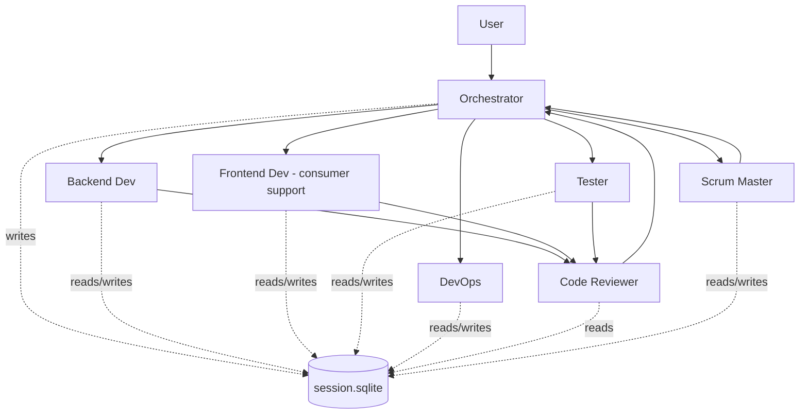

# .NET Agentic Readiness for MediatorLite

## Design Rationale

- **Pure .NET toolchain:** hooks & helpers are `.csx` (dotnet-script) so the repo stays single-runtime. A first-run `bootstrap` hook installs `dotnet-script` globally if missing.
- **SQLite via `Microsoft.Data.Sqlite`:** first-party, no native build step, works on Windows/macOS/Linux CI.
- **Per-project skills** (chosen): each `csproj` gets its own SKILL.md plus one cross-cutting skill — matches the rule "start with `.github/copilot-instructions.md`, use this as the short repo map" in [AGENTS.md](AGENTS.md).
- **Hooks wired at correct lifecycle points:** `beforeCompaction` for durability, `onAgentError` for learning, `beforeCommit`/`beforePush` for quality gates — aligned with Cursor's hook event model.
- **Team composition matches a real scrum team** so the orchestrator can parallelize independent roles and serialize review gates, mirroring the existing `.github/agents/dotnet-self-learning-architect.agent.md` parallel-vs-orchestration policy.

## Target Layout

```
.cursor/
  hooks.json
  agents.md                          # team-level guide + routing rules
  rules/                             # Cursor rules (*.mdc)
  instructions/                      # SDLC workflows (markdown)
  skills/                            # per-project + cross-cutting skills
  agents/                            # 7 role agents
  hooks/                             # .csx scripts (one per hook)
  lib/                               # shared helpers (ContextDb.csx, etc.)
  db/
    schema.sql                       # DDL for session persistence
    session.sqlite                   # runtime (gitignored)
  .gitignore
```

## 1. Rules (`.cursor/rules/*.mdc`)

MDC format with YAML front-matter and `globs`/`alwaysApply` so Cursor auto-attaches them to matching files.

- `00-project-conventions.mdc` — `alwaysApply: true`. net10.0, nullable on, warnings-as-errors, `ValueTask` for handlers/behaviors, `Task<T>` only on the `IMediator` surface (from [Directory.Build.props](Directory.Build.props) and [AGENTS.md](AGENTS.md)).
- `10-dispatch-invariants.mdc` — globs `src/MediatorLite/**`, `src/MediatorLite.Abstractions/**`. Forbids reflection fallback in `Mediator.cs`; `ISourceGeneratedMediator` is mandatory (references [src/MediatorLite/Internal/Mediator.cs](src/MediatorLite/Internal/Mediator.cs) lines 34–50).
- `20-source-generator.mdc` — globs `src/MediatorLite.SourceGeneration/**`. Incremental-only, no reflection on `Compilation`, must emit `RequestHandlerCount`/`NotificationHandlerCount`/`BehaviorCount`/`ValidatorCount` constants.
- `30-pipeline-behaviors.mdc` — ordering via `[BehaviorOrder]` (lower first), validation behaviors emitted first, short-circuit by skipping `next()`.
- `40-notifications.mdc` — compile-time-only strategy resolution; per-type > assembly default > library default (`Sequential`/`StopOnFirstError`). Forbids reintroducing the deleted `NotificationOptionsAttribute`.
- `50-validation.mdc` — `IValidator<T>` + `DataAnnotationsValidator<T>` auto-registered by generator; hand-registration is a smell.
- `60-observability.mdc` — logging category `MediatorLite.IMediator` at `LogDebug`; `ActivitySource` `"MediatorLite"`; opt-outs are the no-arg assembly attributes `DisableMediatorLogging` / `DisableMediatorTracing`.
- `70-testing.mdc` — globs `tests/**`. xUnit + FluentAssertions, layout under `SourceGeneration/` vs `UnitTests/`, `[MediatorGeneration(Skip=true)]` is obsolete and must not appear in new tests.
- `80-benchmarks.mdc` — globs `tests/MediatorLite.Benchmarks/**`, `tests/MediatorLite.RestApiBenchmarks/**`. BenchmarkDotNet conventions, no allocations in hot path assertions.
- `90-public-api-discipline.mdc` — abstractions live in `MediatorLite.Abstractions`; breaking public API needs a lesson + memory entry.

## 2. Instructions (`.cursor/instructions/*.md`)

Reusable SDLC workflows that any agent can open by name:

- `add-new-request-handler.md` — contract-first handler flow (abstractions → src → sample → test) with the exact `AddGeneratedHandlers()` call site.
- `add-new-pipeline-behavior.md` — `[BehaviorOrder]` placement, open vs closed generic registration, short-circuit test.
- `add-new-notification-handler.md` — ordering, strategy attribute decisions, test parity for Sequential/Parallel/StopOnFirstError.
- `add-new-validator.md` — `IValidator<T>` vs DataAnnotations decision tree.
- `extend-source-generator.md` — add a new discovery pipeline alongside the 4 existing ones, emit diagnostic counts, regenerate tests under `SourceGeneration/`.
- `write-and-run-benchmarks.md` — BenchmarkDotNet local workflow + `update-benchmarks-doc.py`.
- `bug-fix-workflow.md` — reproduce → failing test → fix → regression test → lesson.
- `release-workflow.md` — versioning, `publish.yml` walkthrough, changelog.
- `adr-template.md` — lightweight Architecture Decision Record template stored in `.github/Memories`.
- `orchestration-playbook.md` — how the orchestrator dispatches work (parallel vs orchestrated), when to call which agent.

## 3. Skills (`.cursor/skills/<name>/SKILL.md`) — one per project + cross-cutting

Per-project skills (chosen: per_project granularity):

1. `mediatorlite-abstractions` — `IMediator`, `IRequest<T>`, `IRequestHandler<,>`, `INotification`, `INotificationHandler<>`, `IPipelineBehavior<,>`, `ISourceGeneratedMediator`, `Unit`, all attributes. Authoritative reference to [src/MediatorLite.Abstractions/Abstractions/Attributes.cs](src/MediatorLite.Abstractions/Abstractions/Attributes.cs) and [src/MediatorLite.Abstractions/Abstractions/ISourceGeneratedMediator.cs](src/MediatorLite.Abstractions/Abstractions/ISourceGeneratedMediator.cs).
2. `mediatorlite-core` — `Mediator.cs` dispatch, `ServiceCollectionExtensions.AddMediatorLite()`, `PipelineBehaviorTypeResolver`, `MediatorDiagnostics`, `NullSourceGeneratedMediator`, Validation subsystem.
3. `mediatorlite-source-generation` — `HandlerDiscoveryGenerator` internals, the 4 pipelines (requests/notifications/behaviors/validators), inline logging/tracing emission, strategy resolution precedence.
4. `mediatorlite-tests` — xUnit layout (`SourceGeneration/` vs `UnitTests/`), `TestTypes.cs`, handler tracking pattern, notification ordering assertions.
5. `mediatorlite-sample-sourcegen` — end-to-end consumer pattern, the definitive `Program.cs` reference.
6. `mediatorlite-benchmarks` — micro-benchmarks vs MediatR.
7. `mediatorlite-rest-api-benchmarks` — ASP.NET Core parity harness, `BenchmarkParityGuard`, seed data.

Cross-cutting skills (still project-addressable content but span the repo):

8. `mediatorlite-observability` — logging category, activity tags, OpenTelemetry setup (from [docs/observability.md](docs/observability.md)).
9. `mediatorlite-validation` — `ValidationBehavior`, `DataAnnotationsValidator`, `ValidationException`, error contract.
10. `context-db-schema` — how the SQLite session DB is shaped so agents can query it.
11. `agentic-workflow` — team roles, hand-off format, lesson/memory contracts (mirrors `.github/agents/dotnet-self-learning-architect.agent.md`).

Each SKILL.md follows the Anthropic/Cursor skill format with front-matter (`name`, `description`, trigger phrases) and concrete code snippets pulled directly from the repo — not fabricated.

## 4. Custom Agent Team (`.cursor/agents/*.md`)

All agents follow Cursor's agent markdown format (`---` front-matter: `name`, `description`, `tools`, `model`) and each declares which skills it auto-loads, which rules always apply to its work, and its SQLite read/write tables.



1. **`orchestrator.md`** — owns the session DB, decides parallel vs orchestrated execution (policy copied from [.github/agents/dotnet-self-learning-architect.agent.md](.github/agents/dotnet-self-learning-architect.agent.md)), fans out to role agents via the `Task` tool, consolidates their `LessonsSuggested`/`MemoriesSuggested`/`ReasoningSummary` blocks. Can instruct one agent to query another's last output from `agent_messages`. Runs the `beforeCompaction` hook manually if needed.
2. **`scrum-master.md`** — read-only planning role. Breaks stories into tasks, maintains `plans` and `sprint_backlog` tables, generates a daily stand-up digest from the DB, enforces DoR/DoD checklists.
3. **`backend-developer.md`** — owns `src/MediatorLite*/**`. Auto-loads skills 1–3, 8–9; rules 00, 10, 20, 30, 40, 50, 60, 90.
4. **`frontend-developer.md`** — positioned as **consumer-support engineer**: debugs ASP.NET Core/Blazor/WPF apps that consume MediatorLite, produces minimal reproductions, turns them into tests in `MediatorLite.Tests` or samples. Owns `tests/MediatorLite.RestApiBenchmarks/**` and `samples/**` from a consumer perspective. Explicitly called out: "this is a backend library; you exist to diagnose consumer-side integration issues."
5. **`tester.md`** — owns `tests/**`. Auto-loads skill 4. Enforces rule 70. Writes failing tests first for bug fixes (TDD instruction).
6. **`devops.md`** — owns `.github/workflows/**`, `Directory.Build.props`, `publish.yml`, `benchmarks.yml`, `ci.yml`. Auto-loads skills 6, 7.
7. **`code-reviewer.md`** — adapted from [.github/agents/code-reviewer.agent.md](.github/agents/code-reviewer.agent.md) with added DB integration (reads `agent_messages` to see what was actually attempted, writes findings to `reviews`).

## 5. Context-Persistence SQLite DB

**Location:** `.cursor/db/session.sqlite` (gitignored). **Schema** in `.cursor/db/schema.sql`.

Tables:

- `sessions(id TEXT PRIMARY KEY, started_at, ended_at, user_request TEXT, status)`
- `agent_messages(id INTEGER PK, session_id FK, agent_name, role, content, ts)` — one row per significant inter-agent exchange
- `plans(id, session_id FK, title, body_md, status, created_by, ts)` — snapshots of plan-mode artifacts
- `decisions(id, session_id FK, topic, choice, rationale, ts)` — ADRs-lite
- `mistakes(id, session_id FK, agent_name, category, summary, root_cause, fix, lesson_file, ts)` — fed by the error hook
- `reviews(id, session_id FK, target, severity, finding, suggested_fix, reviewer_agent, ts)`
- `sprint_backlog(id, session_id FK, story, acceptance_criteria, status, assigned_agent, ts)`
- `hook_events(id, hook_name, session_id FK, event_type, payload_json, ts)`

All agents receive an auto-injected prompt fragment (via the `agents.md` team guide) telling them to call `.cursor/lib/ContextDb.csx` helpers: `WriteMessage`, `ReadRecent`, `LogDecision`, `LogMistake`. The orchestrator also snapshots the plan markdown into `plans` on creation.

## 6. Hooks (`.cursor/hooks.json` + `.cursor/hooks/*.csx`)

All hooks go through a single `run-hook.ps1` (one-liner shim that invokes `dotnet script`) so `hooks.json` is portable. Each `.csx` references `.cursor/lib/ContextDb.csx` for DB writes.

Requested hooks:

- **`beforeCompaction` → `00-save-context.csx`** — dumps current session (`sessions`, `agent_messages`, `plans`, `decisions`) to a JSON snapshot under `.cursor/db/snapshots/<sessionId>-<ts>.json`, and also calls `VACUUM` on the SQLite file.
- **`onAgentError` → `10-log-mistake.csx`** — captures tool error payload, writes to `mistakes` table, emits a stub `.github/Lessons/YYYY-MM-DD-<slug>.md` pre-filled with the template from `dotnet-self-learning-architect.agent.md` (lines 162–201 of that file).
- **`beforeCommit` / pre-commit → `20-autoreview.csx`** — if no review exists for the current diff's files in `reviews` within last 2 h, blocks commit and prompts the orchestrator to invoke the `code-reviewer` agent.
- **`beforeCommit` → `21-build-gate.csx`** — runs `dotnet build MediatorLite.sln -c Release --nologo -v q`; fails commit on non-zero exit. Skips when only markdown changed (perf).
- **`beforePush` → `30-test-gate.csx`** — runs `dotnet test MediatorLite.sln --nologo -v q --no-restore`; fails push on any test failure. Records pass/fail in `hook_events`.

Additional hooks I recommend (rationale):

- **`afterPlanCreation` → `40-snapshot-plan.csx`** — mirrors every plan created via `CreatePlan` into the `plans` table so Scrum Master can query them.
- **`beforeTurn` → `05-inject-context.csx`** — fetches the last 20 `agent_messages` for the active session and prepends them as a "prior context" block, giving cross-chat persistence requested in the query.
- **`beforeCommit` → `22-lint-gate.csx`** — `dotnet format --verify-no-changes` to prevent style regressions (cheap, <3 s).
- **`onSessionStart` → `01-bootstrap.csx`** — ensures `dotnet-script` is installed (`dotnet tool list -g | findstr dotnet-script` → install if missing), runs `schema.sql` if `session.sqlite` doesn't exist, creates a new `sessions` row, and exports `MEDIATORLITE_SESSION_ID` env var for other hooks to read.
- **`onSessionEnd` → `99-close-session.csx`** — stamps `sessions.ended_at` and writes a final snapshot.

`hooks.json` example shape (single shim, cross-platform):

```json
{
  "hooks": {
    "onSessionStart":    [{ "command": "pwsh -File .cursor/hooks/run-hook.ps1 01-bootstrap.csx" }],
    "beforeTurn":        [{ "command": "pwsh -File .cursor/hooks/run-hook.ps1 05-inject-context.csx" }],
    "beforeCompaction":  [{ "command": "pwsh -File .cursor/hooks/run-hook.ps1 00-save-context.csx" }],
    "onAgentError":      [{ "command": "pwsh -File .cursor/hooks/run-hook.ps1 10-log-mistake.csx" }],
    "afterPlanCreation": [{ "command": "pwsh -File .cursor/hooks/run-hook.ps1 40-snapshot-plan.csx" }],
    "beforeCommit": [
      { "command": "pwsh -File .cursor/hooks/run-hook.ps1 20-autoreview.csx" },
      { "command": "pwsh -File .cursor/hooks/run-hook.ps1 21-build-gate.csx" },
      { "command": "pwsh -File .cursor/hooks/run-hook.ps1 22-lint-gate.csx" }
    ],
    "beforePush":        [{ "command": "pwsh -File .cursor/hooks/run-hook.ps1 30-test-gate.csx" }],
    "onSessionEnd":      [{ "command": "pwsh -File .cursor/hooks/run-hook.ps1 99-close-session.csx" }]
  }
}
```

(If Cursor's current hook spec differs on exact event names on this build, I'll map them at implementation time using `cursor --help` output — noted in plan assumptions.)

## 7. Parallelization at Build Time

I'll spawn **explore** subagents to read the remaining src/test files and **generalPurpose** subagents to draft independent skill/agent files in parallel during implementation:

- Agent A: skills 1–4 (abstractions, core, source-gen, tests)
- Agent B: skills 5–7 (samples, benchmarks)
- Agent C: skills 8–11 (observability, validation, db-schema, agentic-workflow)
- Agent D: rules 00–90 (10 .mdc files)
- Agent E: all 7 role agents + `agents.md`
- Agent F: all `.csx` hooks + `ContextDb.csx` + `schema.sql`
- Agent G: instructions (10 SDLC workflow markdowns)

Orchestrator (me) writes `hooks.json`, `.gitignore`, final wiring last.

## Assumptions / Open Items (flagged, will not block)

- Exact Cursor hook event names (`beforeCompaction`, `onAgentError`, etc.) will be verified against the current Cursor build at implementation time; the shim design makes renames trivial.
- SQLite file is local-only and gitignored; no cross-developer sync.
- `dotnet-script` is installed on first-run; if the user is offline and lacks the tool, the bootstrap hook will print a clear one-line install command and skip gracefully.
