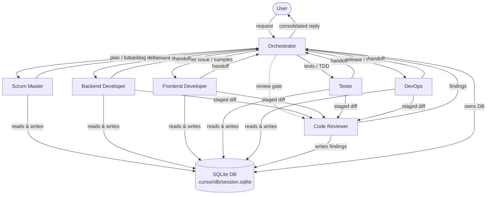

# MediatorLite Agent Team — Routing Guide

This is the team roster and routing guide for the MediatorLite agentic workflow. All role
agents live under [`.cursor/agents/`](./agents/). The orchestrator is the single entry point
for the human user; every inter-agent hand-off is mediated through it.

## Team Roster

| Agent | Slug | One-line Role | User-invocable? |
|-------|------|---------------|:---------------:|
| [Orchestrator](./agents/orchestrator.md)         | `orchestrator`         | Team lead; owns the SQLite DB; picks parallel-vs-orchestration mode; dispatches to role agents; consolidates handoff blocks. | ✓ |
| [Scrum Master](./agents/scrum-master.md)         | `scrum-master`         | Read-only planner; breaks stories into backlog rows; enforces DoR / DoD; produces the standup digest. | ✓ |
| [Backend Developer](./agents/backend-developer.md) | `backend-developer`    | Primary author for `src/MediatorLite*/**`; implements features, fixes bugs, extends the mediator / source-gen / validation / behaviors. | ✓ |
| [Frontend Developer (Consumer-Support Engineer)](./agents/frontend-developer.md) | `frontend-developer` | Diagnoses consumer-side integration problems; owns `samples/**` and the REST-API consumer harness. | ✓ |
| [Tester](./agents/tester.md)                     | `tester`               | Owns `tests/**`; TDD on bug fixes; source-gen vs unit split; runs `dotnet test` on every turn. | ✓ |
| [DevOps](./agents/devops.md)                     | `devops`               | Owns CI, publish, benchmarks, hooks, DB schema; sole agent authorised to commit and tag. | ✓ |
| [Code Reviewer](./agents/code-reviewer.md)       | `code-reviewer`        | Read-only reviewer; writes findings to the `reviews` table keyed on `diff_hash`. | ✓ |

## Routing Rules

Map user intent → primary agent. The orchestrator dispatches; no role agent accepts a
direct user hand-off without the orchestrator in the loop.

| User intent                                                          | Primary agent(s)                         | Notes |
|----------------------------------------------------------------------|------------------------------------------|-------|
| "Plan this feature" / "break this into stories"                      | `scrum-master`                           | Produces Proposed Backlog Deltas; orchestrator persists. |
| "Add a feature to the mediator / generator / validation / behaviors" | `backend-developer` → `tester` → `code-reviewer` | Orchestration mode. |
| "Fix a bug in dispatch / source-gen / validation"                    | `tester` (failing test first) → `backend-developer` → `code-reviewer` | TDD-ordered. |
| "Help me integrate MediatorLite into my app"                         | `frontend-developer`                     | Consumer-support path. |
| "Add a sample" / "extend the REST API harness"                       | `frontend-developer` → `code-reviewer`   | |
| "Add / expand tests"                                                 | `tester` → `code-reviewer`               | |
| "Publish / tag a release"                                            | `devops`                                 | Gated on review + public-API decision. |
| "Run / analyse benchmarks"                                           | `devops`                                 | |
| "Change CI / hooks / DB schema / Directory.Build.props"              | `devops` → `code-reviewer`               | |
| "Review this PR / diff / change"                                     | `code-reviewer`                          | Invoked by orchestrator with `diff_hash`. |
| "Daily standup" / "what's in flight?"                                | `scrum-master`                           | Read-only digest from DB. |
| Ambiguous / cross-cutting                                            | `orchestrator`                           | Asks the user one focused question. |

## Escalation Matrix

The orchestrator mediates **every** cross-agent hand-off. Concretely:

- `backend-developer` → `tester`: via orchestrator, after `dotnet build` green.
- `tester` → `backend-developer`: via orchestrator, when a red test requires a production fix.
- `frontend-developer` → `backend-developer`: via orchestrator, when a consumer issue is
  rooted in `src/**`.
- Any implementer → `code-reviewer`: via orchestrator, **serialised** (review-gate), with the
  computed `diff_hash` in the brief.
- Any agent → `devops`: via orchestrator, for release, CI, hook, or schema concerns.
- `scrum-master` does not receive inter-agent hand-offs; it only receives user-originated
  planning requests routed through the orchestrator.
- Public API changes (rule 90) escalate to the human user via the orchestrator before any
  code is written.

## Team Topology



## How Agents Talk to Each Other

Inter-agent messages use the `agent_messages` table (see
[`.cursor/db/schema.sql`](./db/schema.sql)). The convention is:

- `role='request'` — sent when the orchestrator opens a new task to a role agent.
- `role='handoff'` — sent when the orchestrator dispatches the brief; `target` names the
  receiving agent.
- `role='response'` — the role agent's summary at the end of its turn.
- `role='finding'` — the reviewer's structured findings (in addition to `reviews` rows).

Every agent reads the most recent 10–20 messages at the start of a turn to rehydrate context:

```csharp
// .csx snippet usable from any hook or agent-owned script
#load "../lib/ContextDb.csx"
using static ContextDb;

// 1. Ensure the session exists (idempotent)
var sid = EnsureSession();

// 2. Pull the orchestrator's latest brief for this agent
var recent = ReadRecent(limit: 10, sessionId: sid);
var brief = recent
    .Where(m => m.Role == "handoff" && m.Target == "backend-developer")
    .OrderByDescending(m => m.Ts)
    .FirstOrDefault();

// 3. At the end of the turn, write the response
WriteMessage(
    agent:   "backend-developer",
    role:    "response",
    content: "Implemented the validation-behavior ordering fix; dotnet build green.",
    target:  "orchestrator");
```

The `05-inject-context.csx` beforeTurn hook uses the same helper to surface prior messages to
the incoming agent automatically.

## Lesson / Memory Contract (Summary)

Adapted from
[`.github/agents/dotnet-self-learning-architect.agent.md`](../.github/agents/dotnet-self-learning-architect.agent.md).

- Every successful agent turn ends with the literal block:

  ```
  LessonsSuggested: <title>: <why>  OR  none
  MemoriesSuggested: <title>: <why> OR  none
  ReasoningSummary: <rationale>
  ```

- The orchestrator consolidates `LessonsSuggested` and `MemoriesSuggested` from every
  downstream agent's turn and decides whether to create a new file under `.github/Lessons/`
  or `.github/Memories/`, update an existing file, or skip with reason.
- All lessons and memories carry `PatternId`, `PatternVersion`, `Status` (`active` |
  `deprecated` | `blocked`), and `Supersedes`. See the architect doc for the full template.
- **Pre-write dedupe check**: search existing records for similar root cause / decision /
  impacted area before creating a new file. If a close match exists, update it and bump
  `PatternVersion` rather than creating a duplicate.
- **Conflict resolution**: new evidence that contradicts an `active` pattern marks the older
  one `deprecated` (or `blocked` if unsafe); the new pattern references it via `Supersedes`.
  The orchestrator always surfaces such changes to the user.
- **Safety gate**: never apply or recommend a pattern with `Status: blocked` without
  explicit user confirmation and fresh validation evidence.
- **Reuse priority**: prefer the newest validated `active` pattern; if confidence is low or
  conflict is unresolved, ask the user before applying.
